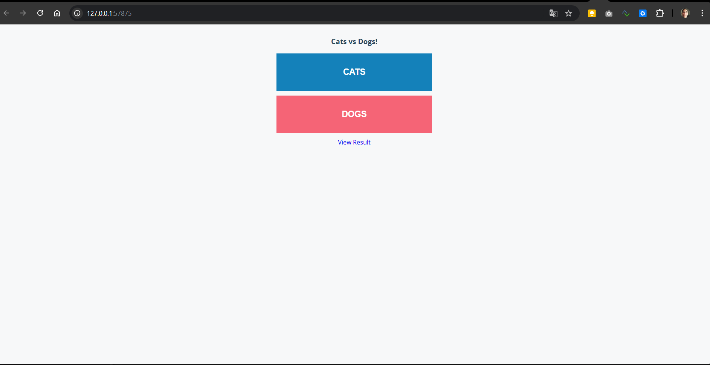
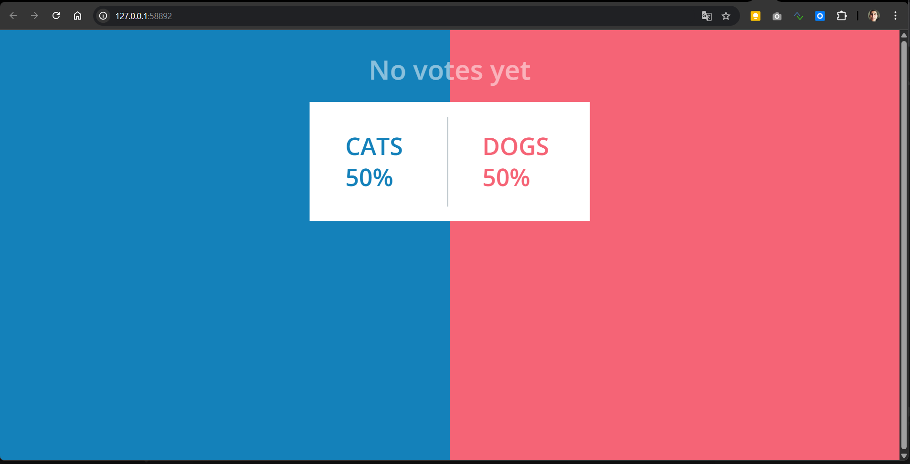
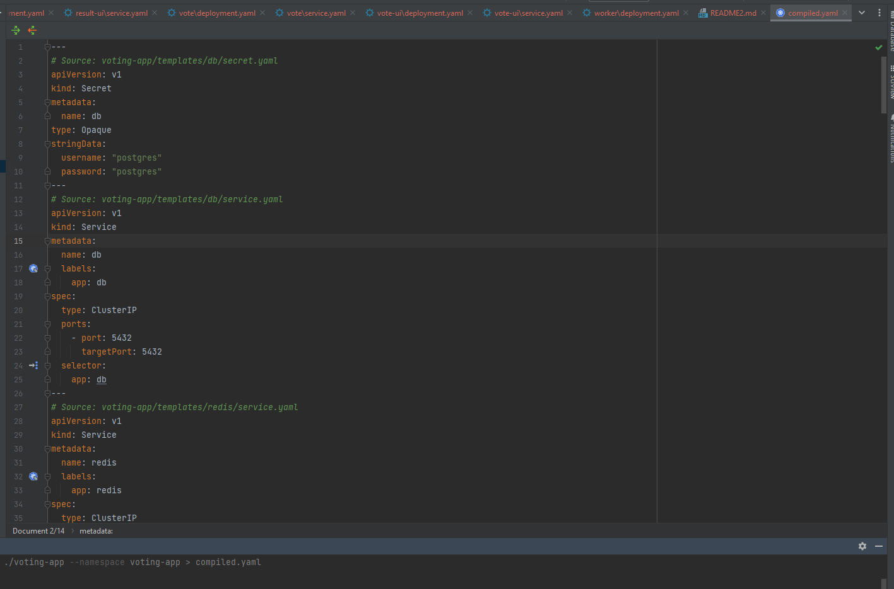

# **Complete Lab (Part 1) – From Docker Compose to Kubernetes and Helm Packaging**

---

## **Objectives**

By the end of this lab, you will be able to:

* Understand how each part of a Docker Compose stack maps to Kubernetes resources.
* Create the complete Voting App manually using raw Kubernetes manifests.
* Organize your manifests properly for maintainability.
* Prepare everything for Helm packaging in Part 2.

---

## **1. Background**

### **From Compose to Kubernetes**

Docker Compose allows quick local orchestration, but it hides many details.
Kubernetes requires explicit resources for deployments, configuration, and networking.

| Concept               | Docker Compose Keyword | Kubernetes Equivalent            | Purpose                    |
| --------------------- | ---------------------- | -------------------------------- | -------------------------- |
| Container definition  | `services:`            | `Deployment`                     | Run one or more pods       |
| Networking            | `networks:`            | `Service` (ClusterIP / NodePort) | Connect pods reliably      |
| Dependencies          | `depends_on:`          | Service DNS + readiness probes   | Define communication       |
| Environment variables | `environment:`         | `env`, `ConfigMap`, `Secret`     | Inject runtime values      |
| Persistent data       | `volumes:`             | `PersistentVolumeClaim` (PVC)    | Keep data after restart    |
| Port exposure         | `ports:`               | `Service` / `Ingress`            | Make accessible externally |

---

## **2. Starting Point – Docker Compose File**

Below is the simplified **Voting App** stack.
You will progressively translate each service into Kubernetes manifests.

```yaml
services:
  vote:
    image: docker.io/${DOCKERHUB_USERNAME}/vote:${IMAGE_TAG}
    depends_on: [redis]
  vote-ui:
    image: docker.io/${DOCKERHUB_USERNAME}/vote-ui:${IMAGE_TAG}
    ports: ["5000:80"]
  result:
    image: docker.io/${DOCKERHUB_USERNAME}/result:${IMAGE_TAG}
    depends_on: [db]
  result-ui:
    image: docker.io/${DOCKERHUB_USERNAME}/result-ui:${IMAGE_TAG}
    ports: ["5001:80"]
  worker:
    image: docker.io/${DOCKERHUB_USERNAME}/worker:${IMAGE_TAG}
    depends_on: [redis, db]
  redis:
    image: redis:7.0.7-alpine3.17
    ports: ["6379:6379"]
  db:
    image: postgres:15.0-alpine3.16
    environment:
      POSTGRES_USER: postgres
      POSTGRES_PASSWORD: postgres
```

---

## **3. Project Structure**

To stay organized, create a directory for each component:

```bash
mkdir -p k8s/{vote,vote-ui,result,result-ui,worker,redis,db}
```

Each folder will later contain the following (as needed):

| File Name                     | Purpose                                                             |
| ----------------------------- | ------------------------------------------------------------------- |
| `deployment.yaml`             | Defines how the application runs (replicas, container, environment) |
| `service.yaml`                | Defines internal/external networking                                |
| `secret.yaml`                 | Stores sensitive data like passwords                                |
| `configmap.yaml` *(optional)* | Stores environment variables or configuration files                 |

---

## **4. Translate Each Service**

You will now create the manifests manually.
Read each goal carefully before creating files.

---

### **4.1 PostgreSQL (Database)**

**Purpose:**
Provides persistent storage for votes and results.

**You need to create:**

1. A **Secret** for credentials (`POSTGRES_USER`, `POSTGRES_PASSWORD`)
2. A **Deployment** running PostgreSQL
3. A **Service** to make the DB reachable by name inside the cluster

**Steps:**

* Use image `postgres:15.0-alpine3.16`
* Use label `app: db`
* Expose port 5432 internally
* Mount credentials from the Secret in the environment section
* Use `ClusterIP` type Service

<details>
<summary>💡 Hint</summary>
Your pods will connect to the DB using the internal DNS name:  
`db.voting-app.svc.cluster.local:5432`.  
NodePort is not needed because only backend components access the database.
</details>

---

### **4.2 Redis**

**Purpose:**
Acts as a fast in-memory store for vote caching and message exchange.

**You need to create:**

* One **Deployment** running `redis:7.0.7-alpine3.17`
* One **Service** exposing it internally

**Steps:**

* Label both resources `app: redis`
* Set the container port to 6379
* Use `ClusterIP` Service

<details>
<summary>💡 Hint</summary>
Redis requires no persistent volume here.  
The hostname `redis` will automatically resolve for other pods.
</details>

---

### **4.3 Vote (Backend)**

**Purpose:**
Handles API requests to record votes into Redis.

**You need to create:**

* A **Deployment** running the container image `voting/vote:v1.0.13`
* A **Service** for internal communication

**Steps:**

* Label resources `app: vote`
* Expose container port 5000
* Add environment variable `REDIS_HOST=redis`
* Service type `ClusterIP`

<details>
<summary>💡 Hint</summary>
The Vote service talks to Redis through DNS (`redis:6379`).  
No database connection required at this stage.
</details>

---

### **4.4 Vote UI (Frontend)**

**Purpose:**
Public interface where users can cast votes.

**You need to create:**

* A **Deployment** running `voting/vote-ui:v1.0.19`
* A **Service** that allows external browser access

**Steps:**

* Label `app: vote-ui`
* Expose port 80 inside the container
* Use `NodePort` type Service
* Assign a port (e.g. 31000) for external access

<details>
<summary>💡 Hint</summary>
You will reach it using  
`http://<node_ip>:31000`.  
This simulates exposing an app to end users.
</details>

---

### **4.5 Result (Backend)**

**Purpose:**
Reads data from the database to compute vote results.

**You need to create:**

* A **Deployment** using image `voting/result:v1.0.16`
* A **Service** for internal access

**Steps:**

* Inject credentials from the `db` Secret
* Expose port 5000 internally
* Use `ClusterIP` type Service
* Label `app: result`

<details>
<summary>💡 Hint</summary>
Result depends on the DB pod, not on Redis.  
Check that environment variables reference the correct Secret keys.
</details>

---

### **4.6 Result UI (Frontend)**

**Purpose:**
Displays the vote results visually.

**You need to create:**

* A **Deployment** using `voting/result-ui:v1.0.15`
* A **Service** exposing port 80 externally

**Steps:**

* Label `app: result-ui`
* Use `NodePort` type Service with port 31001

<details>
<summary>💡 Hint</summary>
Access the results page at  
`http://<node_ip>:31001`.  
Make sure ports 80 and 31001 are consistent between Deployment and Service.
</details>

---

### **4.7 Worker**

**Purpose:**
Background service that synchronizes data between Redis and PostgreSQL.

**You need to create:**

* A **Deployment** only (no Service)

**Steps:**

* Image `voting/worker:v1.0.15`
* Add environment variables:

    * `REDIS_HOST=redis`
    * `DB_HOST=db`
    * Database credentials from Secret `db`
* Label `app: worker`

<details>
<summary>💡 Hint</summary>
The Worker does not expose ports because it only processes data internally.  
It should start successfully once both Redis and DB Services are available.
</details>

---

## **5. Namespace and Common Labels**

Before applying manifests, create the namespace:

```bash
kubectl create namespace voting-app
```

Always include in your YAML:

```yaml
metadata:
  namespace: voting-app
  labels:
    app: <service-name>
```

This ensures consistent grouping and easier cleanup.

---

## **6. Test and Verify**

Once all YAMLs are ready:

```bash
kubectl apply -f k8s/ --recursive
kubectl get pods -n voting-app
kubectl get svc -n voting-app
```


Check NodePort access:

```
minikube service vote-ui -n parking-dev
minikube service result-ui -n parking-dev
```




You should see all seven Deployments running and Services exposing the proper ports.

<details>
<summary>💡 Hint</summary>
If some pods are stuck in `CrashLoopBackOff`, run  
`kubectl logs <pod> -n voting-app` to debug.  
Common issues: wrong env vars or missing Secrets.

</details>

---

## **7. Clean Up**

When done testing:

```bash
kubectl delete namespace voting-app
```

---

## **6. Package into a Helm Chart**

Now that the plain manifests work, let’s turn them into a Helm chart.

### **6.1 Create Chart Skeleton**

```bash
helm create voting-app
```

This creates:

```
voting-app/
├── Chart.yaml
├── values.yaml
└── templates/
```
Delete the sample files inside templates/ to avoid confusion:

```yaml
rm -Recurse -Force voting-app\templates\*
```

---

### **6.2 Move and Template Your Manifests**

Copy the working YAML files into `templates/`.

You already have working YAMLs in:

```
k8s/
├── vote/
├── result/
├── vote-ui/
├── result-ui/
├── worker/
├── redis/
└── db/
```

Copy them into the Helm `templates/` folder, keeping subdirectories for clarity:

```bash
cp -r k8s/* voting-app/templates/
```

Your chart now looks like:

```
voting-app/
├── Chart.yaml
├── values.yaml
└── templates/
    ├── vote/
    ├── vote-ui/
    ├── result/
    ├── result-ui/
    ├── worker/
    ├── redis/
    └── db/
```
> Helm recursively reads all YAMLs under `templates/`.
> This structure avoids overwriting files like `deployment.yaml`.

### **6.3 Replace Hardcoded Values with Template Variables**

Now convert your manifests into Helm templates.

Example: original Deployment from `k8s/vote/deployment.yaml`:

```yaml
apiVersion: apps/v1
kind: Deployment
metadata:
  name: vote
  namespace: voting-app
  labels:
    app: vote
spec:
  replicas: 1
  selector:
    matchLabels:
      app: vote
  template:
    metadata:
      labels:
        app: vote
    spec:
      containers:
        - name: vote
          image: voting/vote:v1.0.13
          ports:
            - containerPort: 5000
          env:
            - name: REDIS_HOST
              value: redis
```

Convert it into a Helm-templated version (`templates/vote/deployment.yaml`):

```yaml
apiVersion: apps/v1
kind: Deployment
metadata:
  name: vote
  labels:
    app: vote
spec:
  replicas: {{ .Values.vote.replicas }}
  selector:
    matchLabels:
      app: vote
  template:
    metadata:
      labels:
        app: vote
    spec:
      containers:
        - name: vote
          image: "{{ .Values.vote.image.repository }}:{{ .Values.vote.image.tag }}"
          ports:
            - containerPort: {{ .Values.vote.containerPort }}
          env:
            - name: REDIS_HOST
              value: {{ .Values.vote.env.redisHost | quote }}
```

---

#### Parameterize Services

Example (`templates/vote/service.yaml`):

```yaml
apiVersion: v1
kind: Service
metadata:
  name: vote
  labels:
    app: vote
spec:
  type: {{ .Values.vote.service.type }}
  ports:
    - port: {{ .Values.vote.service.port }}
      targetPort: {{ .Values.vote.service.targetPort }}
  selector:
    app: vote

```
Here’s the continuation for the **remaining Voting App Helm templates** :

### `templates/vote-ui/deployment.yaml`

```yaml
apiVersion: apps/v1
kind: Deployment
metadata:
  name: vote-ui
  labels:
    app: vote-ui
spec:
  replicas: {{ .Values.voteUi.replicas }}
  selector:
    matchLabels:
      app: vote-ui
  template:
    metadata:
      labels:
        app: vote-ui
    spec:
      containers:
        - name: vote-ui
          image: "{{ .Values.voteUi.image.repository }}:{{ .Values.voteUi.image.tag }}"
          ports:
            - containerPort: {{ .Values.voteUi.containerPort }}
```

### `templates/vote-ui/service.yaml`

```yaml
apiVersion: v1
kind: Service
metadata:
  name: vote-ui
  labels:
    app: vote-ui
spec:
  type: {{ .Values.voteUi.service.type }}
  ports:
    - port: {{ .Values.voteUi.service.port }}
      targetPort: {{ .Values.voteUi.service.targetPort }}
      {{- if eq .Values.voteUi.service.type "NodePort" }}
      nodePort: {{ .Values.voteUi.service.nodePort }}
      {{- end }}
  selector:
    app: vote-ui
```

---

### `templates/result/deployment.yaml`

```yaml
apiVersion: apps/v1
kind: Deployment
metadata:
  name: result
  labels:
    app: result
spec:
  replicas: {{ .Values.result.replicas }}
  selector:
    matchLabels:
      app: result
  template:
    metadata:
      labels:
        app: result
    spec:
      containers:
        - name: result
          image: "{{ .Values.result.image.repository }}:{{ .Values.result.image.tag }}"
          ports:
            - containerPort: {{ .Values.result.containerPort }}
          env:
            - name: POSTGRES_USER
              valueFrom:
                secretKeyRef:
                  name: {{ .Values.db.secretName }}
                  key: username
            - name: POSTGRES_PASSWORD
              valueFrom:
                secretKeyRef:
                  name: {{ .Values.db.secretName }}
                  key: password
```

### `templates/result/service.yaml`

```yaml
apiVersion: v1
kind: Service
metadata:
  name: result
  labels:
    app: result
spec:
  type: {{ .Values.result.service.type }}
  ports:
    - port: {{ .Values.result.service.port }}
      targetPort: {{ .Values.result.service.targetPort }}
  selector:
    app: result
```

---

### `templates/result-ui/deployment.yaml`

```yaml
apiVersion: apps/v1
kind: Deployment
metadata:
  name: result-ui
  labels:
    app: result-ui
spec:
  replicas: {{ .Values.resultUi.replicas }}
  selector:
    matchLabels:
      app: result-ui
  template:
    metadata:
      labels:
        app: result-ui
    spec:
      containers:
        - name: result-ui
          image: "{{ .Values.resultUi.image.repository }}:{{ .Values.resultUi.image.tag }}"
          ports:
            - containerPort: {{ .Values.resultUi.containerPort }}
```

### `templates/result-ui/service.yaml`

```yaml
apiVersion: v1
kind: Service
metadata:
  name: result-ui
  labels:
    app: result-ui
spec:
  type: {{ .Values.resultUi.service.type }}
  ports:
    - port: {{ .Values.resultUi.service.port }}
      targetPort: {{ .Values.resultUi.service.targetPort }}
      {{- if eq .Values.resultUi.service.type "NodePort" }}
      nodePort: {{ .Values.resultUi.service.nodePort }}
      {{- end }}
  selector:
    app: result-ui
```

---

### `templates/worker/deployment.yaml`

```yaml
apiVersion: apps/v1
kind: Deployment
metadata:
  name: worker
  labels:
    app: worker
spec:
  replicas: {{ .Values.worker.replicas }}
  selector:
    matchLabels:
      app: worker
  template:
    metadata:
      labels:
        app: worker
    spec:
      containers:
        - name: worker
          image: "{{ .Values.worker.image.repository }}:{{ .Values.worker.image.tag }}"
          env:
            - name: POSTGRES_USER
              valueFrom:
                secretKeyRef:
                  name: {{ .Values.db.secretName }}
                  key: username
            - name: POSTGRES_PASSWORD
              valueFrom:
                secretKeyRef:
                  name: {{ .Values.db.secretName }}
                  key: password
            - name: REDIS_HOST
              value: {{ .Values.worker.env.redisHost | quote }}
            - name: DB_HOST
              value: {{ .Values.worker.env.dbHost | quote }}
```

---

### `templates/redis/deployment.yaml`

```yaml
apiVersion: apps/v1
kind: Deployment
metadata:
  name: redis
  labels:
    app: redis
spec:
  replicas: {{ .Values.redis.replicas }}
  selector:
    matchLabels:
      app: redis
  template:
    metadata:
      labels:
        app: redis
    spec:
      containers:
        - name: redis
          image: "{{ .Values.redis.image.repository }}:{{ .Values.redis.image.tag }}"
          ports:
            - containerPort: {{ .Values.redis.containerPort }}
```

### `templates/redis/service.yaml`

```yaml
apiVersion: v1
kind: Service
metadata:
  name: redis
  labels:
    app: redis
spec:
  type: {{ .Values.redis.service.type }}
  ports:
    - port: {{ .Values.redis.service.port }}
      targetPort: {{ .Values.redis.service.targetPort }}
  selector:
    app: redis
```

---

### `templates/db/secret.yaml`

```yaml
apiVersion: v1
kind: Secret
metadata:
  name: {{ .Values.db.secretName }}
type: Opaque
stringData:
  username: {{ .Values.db.credentials.username | quote }}
  password: {{ .Values.db.credentials.password | quote }}
```

### `templates/db/deployment.yaml`

```yaml
apiVersion: apps/v1
kind: Deployment
metadata:
  name: db
  labels:
    app: db
spec:
  replicas: {{ .Values.db.replicas }}
  selector:
    matchLabels:
      app: db
  template:
    metadata:
      labels:
        app: db
    spec:
      containers:
        - name: db
          image: "{{ .Values.db.image.repository }}:{{ .Values.db.image.tag }}"
          ports:
            - containerPort: {{ .Values.db.containerPort }}
          env:
            - name: POSTGRES_USER
              valueFrom:
                secretKeyRef:
                  name: {{ .Values.db.secretName }}
                  key: username
            - name: POSTGRES_PASSWORD
              valueFrom:
                secretKeyRef:
                  name: {{ .Values.db.secretName }}
                  key: password
```

### `templates/db/service.yaml`

```yaml
apiVersion: v1
kind: Service
metadata:
  name: db
  labels:
    app: db
spec:
  type: {{ .Values.db.service.type }}
  ports:
    - port: {{ .Values.db.service.port }}
      targetPort: {{ .Values.db.service.targetPort }}
  selector:
    app: db
```

---

#### Define Values in `values.yaml`

Add configuration for each service:

```yaml
# Global configuration
namespace: voting-app

# ---------------------
# Database (PostgreSQL)
# ---------------------
db:
  replicas: 1
  image:
    repository: postgres
    tag: 15.0-alpine3.16
  containerPort: 5432
  service:
    type: ClusterIP
    port: 5432
    targetPort: 5432
  secretName: db
  credentials:
    username: postgres
    password: postgres

# ---------
# Redis
# ---------
redis:
  replicas: 1
  image:
    repository: redis
    tag: 7.0.7-alpine3.17
  containerPort: 6379
  service:
    type: ClusterIP
    port: 6379
    targetPort: 6379

# ---------
# Vote API
# ---------
vote:
  replicas: 1
  image:
    repository: voting/vote
    tag: v1.0.13
  containerPort: 5000
  service:
    type: ClusterIP
    port: 5000
    targetPort: 5000
  env:
    redisHost: redis

# -----------
# Vote UI
# -----------
voteUi:
  replicas: 1
  image:
    repository: voting/vote-ui
    tag: v1.0.19
  containerPort: 80
  service:
    type: NodePort
    port: 80
    targetPort: 80
    nodePort: 31000

# -----------
# Result API
# -----------
result:
  replicas: 1
  image:
    repository: voting/result
    tag: v1.0.16
  containerPort: 5000
  service:
    type: ClusterIP
    port: 5000
    targetPort: 5000

# ------------
# Result UI
# ------------
resultUi:
  replicas: 1
  image:
    repository: voting/result-ui
    tag: v1.0.15
  containerPort: 80
  service:
    type: NodePort
    port: 80
    targetPort: 80
    nodePort: 31001

# ------------
# Worker
# ------------
worker:
  replicas: 1
  image:
    repository: voting/worker
    tag: v1.0.15
  env:
    redisHost: redis
    dbHost: db
```
---

### **6.4 Install and Test**

To preview all the rendered manifests (the compiled output Helm will generate before installation), use:

```bash
helm template voting ./voting-app --namespace voting-app > compiled.yaml
```

This command renders all templates from your chart using the values in `values.yaml` and saves the **full combined YAML** into a single file called `compiled.yaml`.
You can then inspect it:



Now, let's verify our deployment in Minikube.

We have already deployed active manifests in the namespace voting-app during the previous step.

If the namespace already exists, delete it first to start clean:

```bash
kubectl delete ns voting-app
```

Then continue with the following commands:

```bash
helm install voting ./voting-app --namespace voting-app --create-namespace
kubectl get pods -n voting-app
```


Access UI:

```bash
minikube service vote-ui -n voting-app
minikube service result-ui -n voting-app
```

---

### **6.5 Uninstall the Helm Chart**

When you’re done testing or want to redeploy a clean version, remove the release completely.

```bash
helm uninstall voting -n voting-app
```

This command does three things:

1. Deletes all Kubernetes resources created by the Helm chart (Deployments, Services, Secrets, etc.).
2. Keeps your namespace (`voting-app`) intact, in case you want to reinstall later.
3. Frees up NodePorts and ClusterIPs that were allocated.

If you also want to remove the namespace and start fresh:

```bash
kubectl delete ns voting-app
```

After this, you can confirm cleanup with:

```bash
kubectl get all -n voting-app
```

It should return `No resources found`.


---

## **7. Key Learning Summary**

| Compose Element | Kubernetes Equivalent        | Helm Advantage               |
| --------------- | ---------------------------- | ---------------------------- |
| `services:`     | Deployment + Service         | Modular, versioned templates |
| `ports:`        | NodePort / ClusterIP         | Configurable per environment |
| `depends_on:`   | DNS-based discovery          | Managed dependencies         |
| `environment:`  | `env`, `Secret`, `ConfigMap` | Values-driven templating     |
| `volumes:`      | PersistentVolumeClaim        | Optional storage class       |
| `build:`        | Pre-built Docker image       | Built in CI/CD stage         |

---
**Next Lab → Part 2:**

You will use **GitHub Actions** to **build and push Docker images to Amazon ECR**,
and then automatically **deploy the Helm chart to Amazon EKS**.
