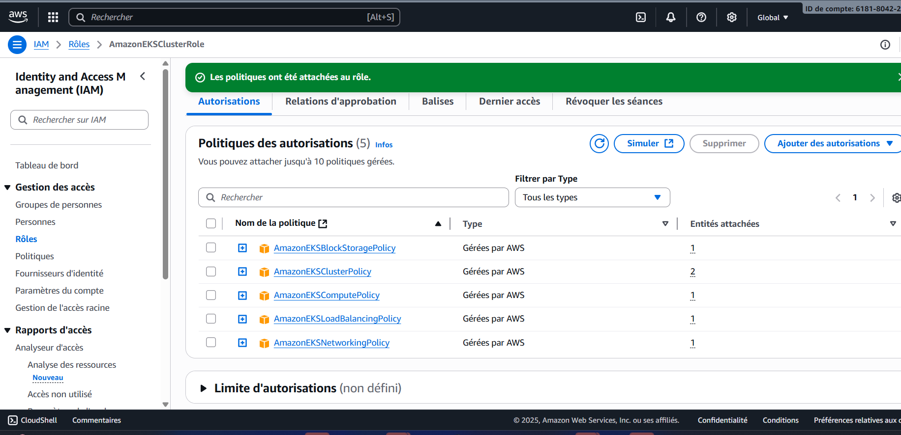
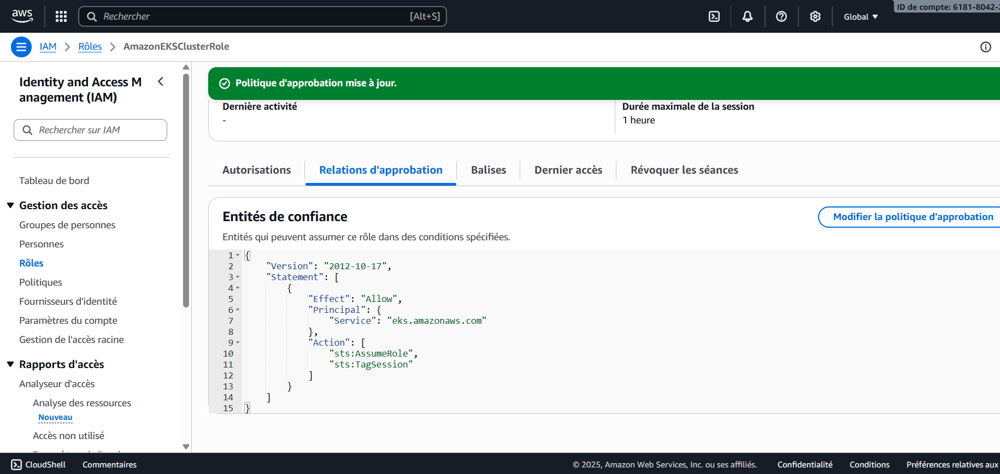
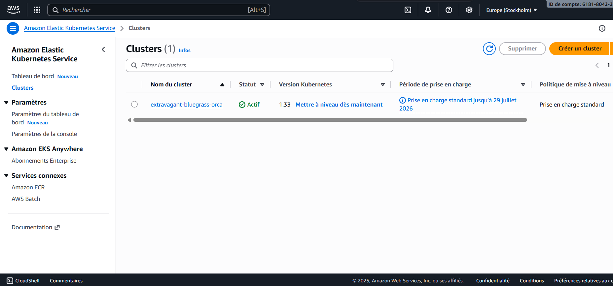
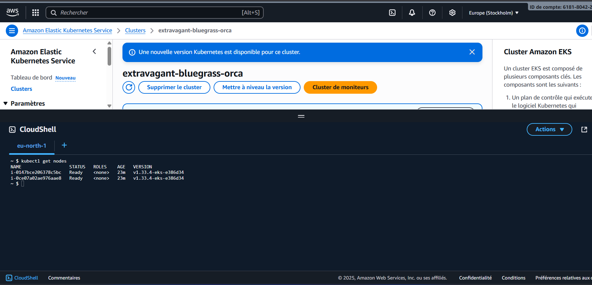
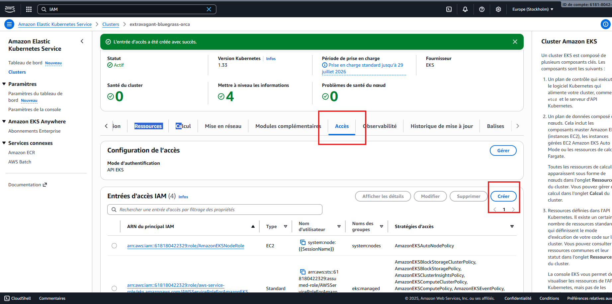
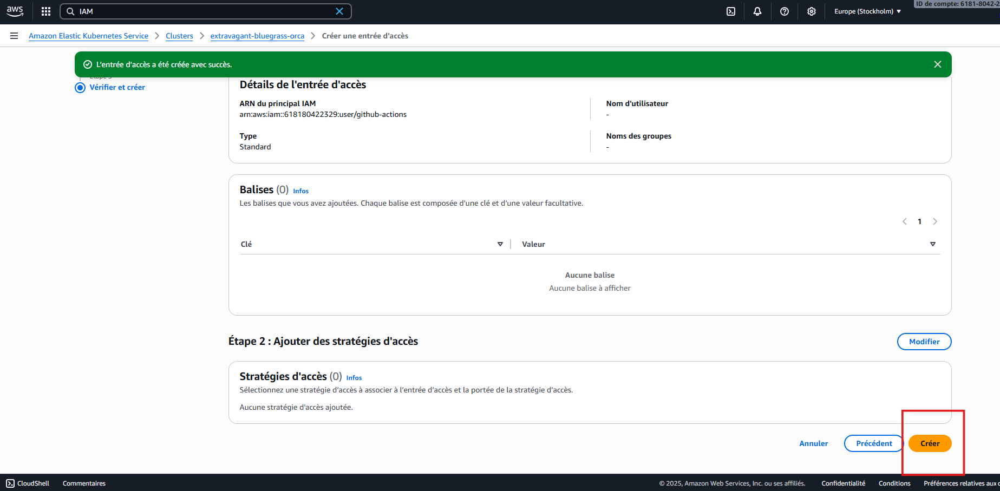
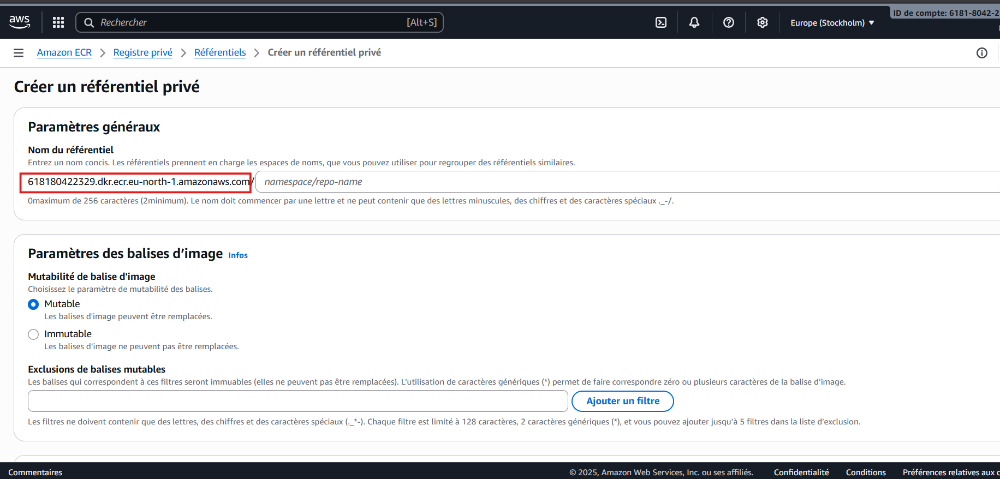

# **Complete Lab (part2) – CI/CD Deployment of the Voting App to AWS EKS using GitHub Actions**

---

## **Objectives**

At the end of this lab, you will:

* Build Docker images for all **Voting App** microservices.
* Push them automatically to **Amazon Elastic Container Registry (ECR)**.
* Deploy and update the application on **Amazon Elastic Kubernetes Service (EKS)** using **Helm**.
* Orchestrate the entire workflow through **GitHub Actions**.

---

## **1 – Overview**

You previously packaged the app into a Helm chart and deployed it locally.
Now, you will move that process into the cloud, with AWS as the runtime and GitHub Actions as the automation engine.

| Step | Tool               | Purpose                   |
| ---- | ------------------ | ------------------------- |
| 1    | **GitHub Actions** | CI/CD orchestration       |
| 2    | **ECR**            | Image registry            |
| 3    | **EKS**            | Kubernetes hosting        |
| 4    | **Helm**           | Application packaging     |
| 5    | **IAM**            | Secure AWS authentication |

---

## **2 – Prerequisites**

| Requirement        | Description                                                  |
| ------------------ | ------------------------------------------------------------ |
| AWS Account        | With rights to create IAM users, ECR repos, and EKS clusters |
| EKS Cluster        | Running (example : `voting-cluster`)                         |
| Helm Chart         | From Lab 21 (`voting-app/`)                                  |
| GitHub Repository  | Containing your app source and chart                         |
| Docker Installed   | To test builds locally                                       |
| Kubectl Configured | Access to your EKS cluster verified                          |

---

# **2.1 – Create an Amazon EKS Cluster (Auto Mode) via Console**

---

## **1. Open the EKS Console**

* Go to [https://console.aws.amazon.com/eks](https://console.aws.amazon.com/eks)
* Click **“Add cluster” → “Create”**

You’ll arrive on the **Cluster configuration** page.

---

## **2. Choose Configuration Mode**

When prompted:

> **Cluster configuration options**

Select → **Quick configuration (with EKS Auto Mode)**
*(recommended for labs and production-ready defaults)*

This will automatically manage networking, nodes, and storage.

---

## **3. Cluster Configuration**

| Field                  | Action                                        |
| ---------------------- | --------------------------------------------- |
| **Name**               | Enter a unique name, e.g. `voting-cluster`    |
| **Kubernetes version** | Leave default (latest version)                |
| **Cluster IAM role**   | You must create or select one (see next step) |

---

## **4. Create the Cluster IAM Role**

This role allows the EKS **control plane** to manage AWS resources such as networking, storage, and load balancers.

### **Step 1 – Go to IAM → Roles → Create role**

* **Trusted entity type:** AWS Service
* **Use case:** search and select `EKS` → choose **EKS - Cluster**
* Click **Next**

### **Step 2 – Attach Policies**

Select and attach **all five managed policies**:

```
AmazonEKSClusterPolicy
AmazonEKSBlockStoragePolicy
AmazonEKSComputePolicy
AmazonEKSLoadBalancingPolicy
AmazonEKSNetworkingPolicy
```


Click **Next**, name the role:

```
AmazonEKSClusterRole
```

Then click **Create role**.

---

### **Step 3 – Edit Trust Relationship**

Once created:

1. Open the role → **Trust relationships → Edit trust policy**
2. Replace its JSON with:

```json
{
  "Version": "2012-10-17",
  "Statement": [
    {
      "Effect": "Allow",
      "Principal": {
        "Service": "eks.amazonaws.com"
      },
      "Action": [
        "sts:AssumeRole",
        "sts:TagSession"
      ]
    }
  ]
}
```



3. Save changes.

---

**Result:**
You now have a cluster role named `AmazonEKSClusterRole` with the correct trust policy and permissions.

Return to the EKS console → **Refresh**, and select this role under **Cluster IAM role**.

---

## **5. Create the Node IAM Role**

Worker nodes (EC2 or managed nodes) need their own IAM role so they can join the cluster and pull images.

### **Step 1 – Go to IAM → Roles → Create role**

* **Trusted entity type:** AWS Service
* **Use case:** search for `EKS` → choose **EKS - Node**
* Click **Next**

### **Step 2 – Attach Policies**

Attach these **three managed policies**:

```
AmazonEKSWorkerNodePolicy
AmazonEC2ContainerRegistryReadOnly

```

Click **Next**, then name it:

```
AmazonEKSNodeRole
```

Click **Create role**.

---

### **Step 3 – Verify Trust Relationship**

It should look like this by default:

```json
{
  "Version": "2012-10-17",
  "Statement": [
    {
      "Effect": "Allow",
      "Principal": {
        "Service": "ec2.amazonaws.com"
      },
      "Action": "sts:AssumeRole"
    }
  ]
}
```

If it matches, leave it as is.

---

**Result:**
Your **Node Role** is now ready — `AmazonEKSNodeRole`.

---

## **6. Continue Cluster Setup**

Back in the **EKS Console → Create Cluster** wizard:

| Section              | Action                                                                 |
| -------------------- | ---------------------------------------------------------------------- |
| **Cluster IAM role** | Select `AmazonEKSClusterRole`                                          |
| **Node IAM role**    | Select `AmazonEKSNodeRole`                                             |
| **VPC**              | Choose an existing VPC (or let EKS Auto Mode create one)               |
| **Subnets**          | Select at least two public subnets (or let EKS Auto Mode create one)                                       |


Then click **Next → Create cluster**.

---

## **7. Wait for Cluster Creation**

EKS will provision the control plane and networking.
This can take **10–15 minutes**.

Once done, the cluster status becomes:

```
Active
```



---

## **8. Verify the Cluster**

### via Console

Now connect using:

```bash
aws eks update-kubeconfig --name voting-cluster
kubectl get nodes
```



---

You now have a **fully functional EKS Auto Mode cluster**, ready for your **GitHub Actions CI/CD deployment **.


## **3 – Create an IAM User for GitHub Actions**

GitHub Actions needs its own AWS credentials to push images and deploy updates.

1. Go to **AWS Console → IAM → Users → Add user**.

2. **User name:** `github-actions`.

3. Enable **Programmatic access** (no console access).

4. Click **Next: Permissions → Attach existing policies directly**.

5. Select these managed policies:

   ```
   AmazonEC2ContainerRegistryFullAccess
   AmazonEKSClusterPolicy
   AmazonEKSWorkerNodePolicy
   AmazonEKSServicePolicy
   ```

6. Finish → **Create user**.

7. Copy the **Access key ID** and **Secret access key** — they will become GitHub secrets.

    * **Access key ID = AWS_ACCESS_KEY_ID**
    * **Secret access key = AWS_SECRET_ACCESS_KEY**
---

💡 **Hint:** This user does **not** need console access, only API access.

## 3.1 – Granting GitHub Actions Access to EKS

When a GitHub Actions workflow deploys to an EKS cluster using Helm, it authenticates with an **IAM user** (for example, `github-actions`) defined by the secrets
`AWS_ACCESS_KEY_ID` and `AWS_SECRET_ACCESS_KEY`.

By default, this IAM user **does not have Kubernetes-level (RBAC) permissions**, so it cannot list or create Kubernetes resources such as `secrets`, `pods`, or `deployments`.
To fix this, we must explicitly grant the IAM user **cluster-admin** privileges inside the EKS cluster.

---

### Step 1 – Connect to the cluster using AWS CloudShell

1. Open **AWS CloudShell** from the AWS Console (top right corner).
2. Connect to your EKS cluster by running:

   ```bash
   aws eks update-kubeconfig --name extravagant-bluegrass-orca --region eu-north-1
   ```

   This command configures `kubectl` to communicate with your EKS cluster.

---

### Step 2 – Create a ClusterRoleBinding for the GitHub IAM user

Run the following command directly in CloudShell:

```bash
kubectl apply -f - <<'EOF'
apiVersion: rbac.authorization.k8s.io/v1
kind: ClusterRoleBinding
metadata:
  name: github-actions-admin
roleRef:
  apiGroup: rbac.authorization.k8s.io
  kind: ClusterRole
  name: cluster-admin
subjects:
  - kind: User
    name: arn:aws:iam::618180422329:user/github-actions
    apiGroup: rbac.authorization.k8s.io
EOF
```

This creates a **ClusterRoleBinding** named `github-actions-admin` that links the IAM user `github-actions` to the `cluster-admin` role.
It gives the GitHub Actions workflow full access to manage all Kubernetes resources in the cluster.

---

### Step 3 – Register the IAM user in the EKS Access UI

In the AWS Console:

1. Go to **EKS → Clusters → voting-app → Access**.
   
2. Click **Add access entry**.
3. For **Principal type**, choose **IAM user**, then select your `github-actions` user.
   
4. Do **not** add any access policies — this step is optional.
   
5. Click **Create**.
   
   This UI action registers the IAM user with the EKS cluster’s access control system.
   
   Combined with the previous `ClusterRoleBinding`, it ensures that GitHub Actions can both **authenticate** (via IAM) and **authorize** (via RBAC) to manage Kubernetes resources.

---

By combining both steps:

* **EKS Access Entry** → allows the IAM user to connect to the cluster.
* **ClusterRoleBinding** → gives that user Kubernetes admin privileges.

Together, they enable your GitHub Actions pipeline to perform Helm deployments and manage resources seamlessly within EKS.


## **4 – Create or Identify Your ECR Registry**

ECR stores Docker images. Each service (vote, result, etc.) will have its own repository.

### What is it?

Your ECR registry URL identifies your AWS account and region.
It looks like this:

```
<account-id>.dkr.ecr.<region>.amazonaws.com
```

### **Find Your ECR Registry URL via Console**

1. Go to **ECR → Repositories**
2. Click **Create ** (top right)



3. Copy the line that looks like this:

   👉 **`618180422329.dkr.ecr.eu-west-3.amazonaws.com`**

Use that for the GitHub secret `ECR_REGISTRY`.

---

## **5 – Add AWS Secrets to GitHub**

In your GitHub repository:
**Settings → Secrets and variables → Actions → New repository secret**

Create these entries:

| Secret Name             | Example Value                                |
| ----------------------- | -------------------------------------------- |
| `AWS_ACCESS_KEY_ID`     | AKIA…                                        |
| `AWS_SECRET_ACCESS_KEY` | wJalr…                                       |
| `AWS_REGION`            | eu-west-3                                    |
| `ECR_REGISTRY`          | 618180422329.dkr.ecr.eu-west-3.amazonaws.com |
| `EKS_CLUSTER_NAME`      | voting-cluster                               |
| `K8S_NAMESPACE`         | voting-app                                   |

All six should appear in your secrets list.


---

## **6 – Prepare the Project Structure**

```
.
├── .github/
│   └── workflows/
│       └── eks-cicd.yml
├── voting-app/
│   ├── Chart.yaml
│   ├── values.yaml
│   └── templates/
│       ├── vote/
│       ├── result/
│       ├── worker/
│       ├── redis/
│       └── db/
├── vote/
│   └── Dockerfile
├── vote-ui/
│   └── Dockerfile
├── result/
│   └── Dockerfile
├── result-ui/
│   └── Dockerfile
└── worker/
    └── Dockerfile
```

Each service folder contains its Dockerfile from previous labs.

---

## **7 – Create the GitHub Actions Workflow Step by Step**

Now we’ll automate the deployment of the **Voting App** to **AWS EKS** using **GitHub Actions**.
The pipeline has **two jobs**:

1. **Build and Push** → build Docker images and push them to **ECR**
2. **Deploy to EKS** → deploy and upgrade the Helm chart on your EKS cluster

Everything goes inside:
`.github/workflows/eks-cicd.yml`

---

### **7.1 – Define When the Workflow Runs**

We want to:

* run automatically whenever someone pushes to the `main` branch, and
* also trigger it manually from GitHub’s **Actions** tab.

```yaml
on:
  push:
    branches: [ main ]
  workflow_dispatch:
```

💡 **Hint:**
`workflow_dispatch` lets you run the pipeline manually — useful for testing.

---

### **7.2 – Declare Global Environment Variables**

We’ll reuse these values multiple times across both jobs.

```yaml
env:
  AWS_REGION: ${{ secrets.AWS_REGION }}
  EKS_CLUSTER_NAME: ${{ secrets.EKS_CLUSTER_NAME }}
  K8S_NAMESPACE: ${{ secrets.K8S_NAMESPACE }}
  IMAGE_TAG: ${{ github.sha }}
```

💡 **Hint:**
`github.sha` automatically sets the Docker image tag to the current commit hash — a simple versioning mechanism.

---

### **7.3 – Job 1: Build and Push Images**

Name: `build-and-push`
Goal: build the Docker images and push them to your **Amazon ECR** registry.

---

#### Step 1 – Checkout the Code

```yaml
- name: Checkout code
  uses: actions/checkout@v4
```

💡 This makes the source code available to the GitHub Actions runner.

---

#### Step 2 – Configure AWS Credentials

```yaml
- name: Configure AWS credentials
  uses: aws-actions/configure-aws-credentials@v4
  with:
    aws-access-key-id: ${{ secrets.AWS_ACCESS_KEY_ID }}
    aws-secret-access-key: ${{ secrets.AWS_SECRET_ACCESS_KEY }}
    aws-region: ${{ secrets.AWS_REGION }}
```

💡 **Hint:**
This authenticates your workflow to AWS using the secrets you added earlier.

---

#### Step 3 – Log in to Amazon ECR

```yaml
- name: Log in to Amazon ECR
  id: login-ecr
  uses: aws-actions/amazon-ecr-login@v2
```

💡 This automatically runs `docker login` with your ECR credentials.

---

#### Step 4 – Make Sure ECR Repositories Exist

Before pushing, we check if each service’s ECR repository exists — if not, create it.

```yaml
- name: Ensure ECR repositories exist
  run: |
    SERVICES=("vote" "vote-ui" "result" "result-ui" "worker")
    for SERVICE in "${SERVICES[@]}"; do
      echo "Ensuring repo $SERVICE"
      aws ecr describe-repositories --repository-names $SERVICE >/dev/null 2>&1 || \
      aws ecr create-repository --repository-name $SERVICE --region $AWS_REGION
    done
```

💡 **Hint:**
This makes your workflow **idempotent** — you can rerun it without errors even if repos already exist.

---

#### Step 5 – Build and Push Docker Images

```yaml
- name: Build and Push Docker images
  env:
    ECR_REGISTRY: ${{ steps.login-ecr.outputs.registry }}
  run: |
    SERVICES=("vote" "vote-ui" "result" "result-ui" "worker")
    for SERVICE in "${SERVICES[@]}"; do
      IMAGE_URI="$ECR_REGISTRY/$SERVICE:${IMAGE_TAG}"
      echo "Building $SERVICE → $IMAGE_URI"
      if [ "$SERVICE" = "worker" ]; then
        docker build -t "$IMAGE_URI" -f "./$SERVICE/src/Dockerfile" "./$SERVICE/src"
      else
        docker build -t "$IMAGE_URI" "./$SERVICE"
      fi
      docker push "$IMAGE_URI"
    done
```

💡 **Hint:**
This loops over all five services, builds each image, tags it with the current commit hash, and pushes it to your ECR registry.

---

### **7.4 – Job 2: Deploy to EKS**

Name: `deploy-to-eks`
Goal: deploy the latest Docker images using the Helm chart.

We make this job **depend on** the previous one:

```yaml
needs: build-and-push
```

---

#### Step 1 – Checkout the Code Again

```yaml
- name: Checkout code
  uses: actions/checkout@v4
```

---

#### Step 2 – Configure AWS Credentials Again

```yaml
- name: Configure AWS credentials
  uses: aws-actions/configure-aws-credentials@v4
  with:
    aws-access-key-id: ${{ secrets.AWS_ACCESS_KEY_ID }}
    aws-secret-access-key: ${{ secrets.AWS_SECRET_ACCESS_KEY }}
    aws-region: ${{ secrets.AWS_REGION }}
```

---

#### Step 3 – Connect to the EKS Cluster

```yaml
- name: Connect to EKS cluster
  run: aws eks update-kubeconfig --name ${{ secrets.EKS_CLUSTER_NAME }} --region ${{ secrets.AWS_REGION }}
```

💡 This sets up `kubectl` so the workflow can talk to your cluster.

---

#### Step 4 – Deploy the Helm Chart

```yaml
- name: Deploy Helm Chart
  env:
    ECR_REGISTRY: ${{ secrets.ECR_REGISTRY }}
  run: |
    helm upgrade --install voting ./voting-app \
      --namespace ${{ secrets.K8S_NAMESPACE }} \
      --create-namespace \
      --set vote.image.repository=$ECR_REGISTRY/vote \
      --set vote.image.tag=${{ github.sha }} \
      --set voteUi.image.repository=$ECR_REGISTRY/vote-ui \
      --set voteUi.image.tag=${{ github.sha }} \
      --set result.image.repository=$ECR_REGISTRY/result \
      --set result.image.tag=${{ github.sha }} \
      --set resultUi.image.repository=$ECR_REGISTRY/result-ui \
      --set resultUi.image.tag=${{ github.sha }} \
      --set worker.image.repository=$ECR_REGISTRY/worker \
      --set worker.image.tag=${{ github.sha }}
```

💡 **Hint:**
`helm upgrade --install` ensures that:

* if the release doesn’t exist, it’s created;
* if it does, it’s upgraded with the new image tags.

---

#### Step 5 – Verify the Deployment

```yaml
- name: Verify deployment
  run: |
    kubectl get pods -n ${{ secrets.K8S_NAMESPACE }}
    kubectl get svc -n ${{ secrets.K8S_NAMESPACE }}
```

💡 This simply lists the pods and services — you should see the new versions rolling out.

---

### **7.5 – Complete Workflow File**

Once you’ve understood each part, here’s the full workflow together:

```yaml
name: Voting App – Build & Deploy to AWS EKS (ARM64 + Cache)

on:
   push:
      branches: [ main ]
   workflow_dispatch:

env:
   AWS_REGION: ${{ secrets.AWS_REGION }}
   ECR_REGISTRY: ${{ secrets.ECR_REGISTRY }}
   EKS_CLUSTER_NAME: ${{ secrets.EKS_CLUSTER_NAME }}
   K8S_NAMESPACE: ${{ secrets.K8S_NAMESPACE }}
   IMAGE_TAG: ${{ github.sha }}

jobs:

   build:
      name: Build and Push ARM64 Docker Images
      runs-on: ubuntu-latest
      outputs:
         image_tag: ${{ env.IMAGE_TAG }}

      steps:
         - uses: actions/checkout@v4

         - uses: aws-actions/configure-aws-credentials@v4
           with:
              aws-access-key-id: ${{ secrets.AWS_ACCESS_KEY_ID }}
              aws-secret-access-key: ${{ secrets.AWS_SECRET_ACCESS_KEY }}
              aws-region: ${{ env.AWS_REGION }}

         - uses: docker/setup-buildx-action@v3

         - name: Cache Docker layers
           uses: actions/cache@v4
           with:
              path: /tmp/.buildx-cache
              key: ${{ runner.os }}-buildx-${{ github.ref_name }}
              restore-keys: |
                 ${{ runner.os }}-buildx-

         - name: Login to Amazon ECR
           run: aws ecr get-login-password --region $AWS_REGION | docker login --username AWS --password-stdin $ECR_REGISTRY

         - name: Ensure ECR repositories exist
           run: |
              for repo in vote vote-ui result result-ui worker; do
                aws ecr describe-repositories --repository-names $repo >/dev/null 2>&1 || \
                aws ecr create-repository --repository-name $repo --region $AWS_REGION
              done

         - name: Build and Push ARM64 Docker Images
           run: |
              for svc in vote vote-ui result result-ui worker; do
                echo "Building $svc → $ECR_REGISTRY/$svc:$IMAGE_TAG"
                if [ "$svc" = "worker" ]; then
                  docker buildx build --platform linux/arm64 \
                    --cache-from type=local,src=/tmp/.buildx-cache \
                    --cache-to type=local,dest=/tmp/.buildx-cache,mode=max \
                    -t $ECR_REGISTRY/$svc:$IMAGE_TAG \
                    -f "./$svc/src/Dockerfile" "./$svc/src" --push
                else
                  docker buildx build --platform linux/arm64 \
                    --cache-from type=local,src=/tmp/.buildx-cache \
                    --cache-to type=local,dest=/tmp/.buildx-cache,mode=max \
                    -t $ECR_REGISTRY/$svc:$IMAGE_TAG "./$svc" --push
                fi
              done

   deploy:
      name: Deploy Voting App to AWS EKS
      runs-on: ubuntu-latest
      needs: build

      steps:
         - uses: actions/checkout@v4

         - uses: aws-actions/configure-aws-credentials@v4
           with:
              aws-access-key-id: ${{ secrets.AWS_ACCESS_KEY_ID }}
              aws-secret-access-key: ${{ secrets.AWS_SECRET_ACCESS_KEY }}
              aws-region: ${{ env.AWS_REGION }}

         - name: Connect to EKS Cluster
           run: aws eks update-kubeconfig --name $EKS_CLUSTER_NAME

         - name: Deploy via Helm
           run: |
              echo "Using registry: $ECR_REGISTRY"
              helm upgrade --install voting ./voting-app \
                --namespace $K8S_NAMESPACE --create-namespace \
                --set vote.image.repository=$ECR_REGISTRY/vote \
                --set vote.image.tag=$IMAGE_TAG \
                --set voteUi.image.repository=$ECR_REGISTRY/vote-ui \
                --set voteUi.image.tag=$IMAGE_TAG \
                --set result.image.repository=$ECR_REGISTRY/result \
                --set result.image.tag=$IMAGE_TAG \
                --set resultUi.image.repository=$ECR_REGISTRY/result-ui \
                --set resultUi.image.tag=$IMAGE_TAG \
                --set worker.image.repository=$ECR_REGISTRY/worker \
                --set worker.image.tag=$IMAGE_TAG

         - name: Verify Deployment
           run: |
              kubectl get pods -n $K8S_NAMESPACE
              kubectl get svc -n $K8S_NAMESPACE
```

---


## **8 – How It Works**

| Step              | Description                                      |
| ----------------- | ------------------------------------------------ |
| Checkout          | Pulls repo content into the runner               |
| Configure AWS     | Authenticates GitHub Actions to AWS              |
| ECR Login         | Logs Docker into your private registry           |
| Ensure Repos      | Creates missing ECR repos automatically          |
| Build + Push      | Builds all Docker images and uploads them to ECR |
| Update Kubeconfig | Connects kubectl to EKS                          |
| Helm Upgrade      | Deploys the Helm chart with the new image tags   |
| Verify            | Lists running pods and services                  |

---

## **9 – Trigger the Pipeline**

Commit and push:

```bash
git add .
git commit -m "Add CI/CD workflow for AWS EKS"
git push origin main
```

Then open **GitHub → Actions**.
You’ll see two jobs running:

1. **Build and Push Docker images**
2. **Deploy to EKS with Helm**

Both should complete successfully.

---

## **10 – Verify Deployment on EKS**

Check the application state:

```bash
kubectl get pods -n voting-app
kubectl get svc -n voting-app
```

If your `vote-ui` and `result-ui` services are **NodePort** or **LoadBalancer**, display the external address:

```bash
kubectl get svc vote-ui -n voting-app
```

Then open:

```
http://<EXTERNAL-IP>:80
```

You should see the voting interface.

---

## **11 – Cleanup**

Remove all resources:

```bash
helm uninstall voting -n voting-app
kubectl delete ns voting-app
```

Optionally, delete ECR repositories from the AWS Console if you no longer need them.

---

## **12 – Summary**

| Component          | Role                                 |
| ------------------ | ------------------------------------ |
| **Helm Chart**     | Packages Kubernetes manifests        |
| **GitHub Actions** | Automates CI/CD                      |
| **ECR**            | Hosts built Docker images            |
| **EKS**            | Runs the production workloads        |
| **IAM User**       | Provides GitHub → AWS authentication |

Each push to `main` now automatically:

1. Builds and tags the microservice images.
2. Pushes them to ECR.
3. Deploys them to EKS via Helm.
4. Verifies rollout.

---

**End of Lab**

You now own a **complete production-grade CI/CD pipeline**: GitHub → AWS ECR → EKS, fully automated through Helm.
